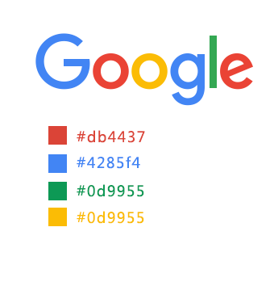
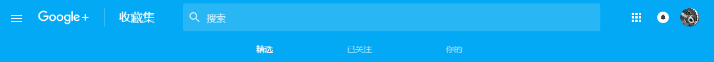
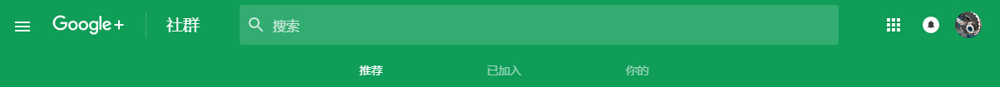
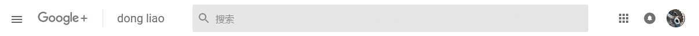
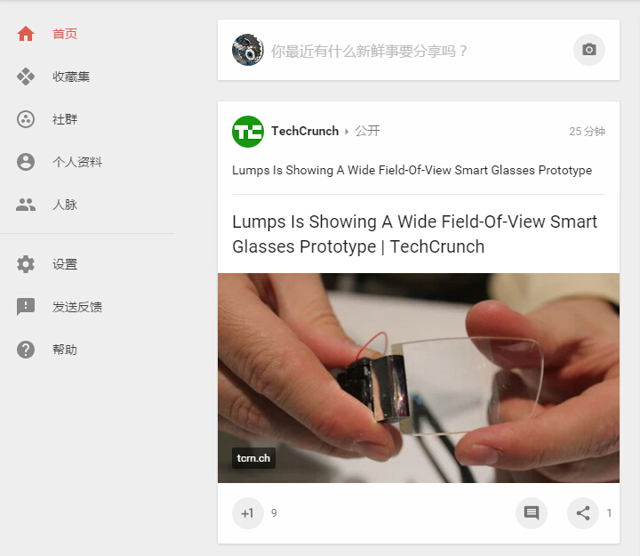
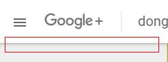
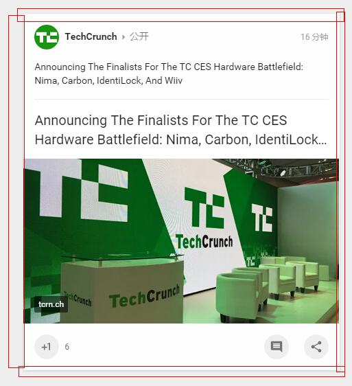
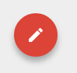

#Google+ material design 设计风格研究
##配色
>Google+主要配色是围绕谷歌新logo展开的，社区除topbar有鲜明色色块外，其他部分都是以白、灰、淡米黄、投影这些设计元素来展开的。

-------------------------

###topbar主要频道的配色情况

>与谷歌logo配色如出一辙，首页红色是`#db4437`，收藏集蓝色是`#7285f4`，社群绿色是`#0d9955`。大概是遵循“配色不超过3种”的原则吧，主要频道以外的topbar,都是使用白色的背景色，因为严格意义上来说黑、白、灰不能算是颜色。“中高饱和度、高亮度”是它的用色特点。

###背景色

>所谓的“淡米黄”指的就是上图这个背景色，它准确的配色值是`#eee`,它既是背景色也是点缀修饰色，分享块里里面的评论、点赞、评论这些小icon的背景色也是`#eee`

##material细节分析
material design的特点是微厚度、微阴影，通过阴影的调节来表现深度层次。在网页里需要表现出这一特点，最重要的就是使用box-shadow这一属性了。

----------------------------
*box-shadow语法：{box-shadow:[inset] x-offset y-offset blur-radius spread-radiuscolor}*

*阴影类型：此参数可选。如不设值，默认投影方式是外阴影；如取其唯一值“inset”，其投影为内阴影；*

*X-offset:阴影水平偏移量，其值可以是正负值。如果值为正值，则阴影在对象的右边，其值为负值时，阴影在对象的左边；*

*Y-offset:阴影垂直偏移量，其值也可以是正负值。如果为正值，阴影在对象的底部，其值为负值时，阴影在对象的顶部；*

*阴影模糊半径：此参数可选，，但其值只能是为正值，如果其值为0时，表示阴影不具有模糊效果，其值越大阴影的边缘就越模糊；*

*阴影扩展半径：此参数可选，其值可以是正负值，如果值为正，则整个阴影都延展扩大，反之值为负值时，则缩小；*

*阴影颜色：此参数可选。如不设定颜色，浏览器会取默认色，但各浏览器默认取色不一致，特别是在webkit内核下的safari和chrome浏览器下表现为透明色，在Firefox/Opera下表现为黑色（已验证），建议不要省略此参数。*

-----------------------------------
Google+表现微厚度、微阴影的具体使用情况分析如下：

>`box-shadow:0px 1px 8px rgba(0,0,0,0.3);`

---

>`box-shadow: 0px 1px 4px 0px rgba(0,0,0,0.14);`

---

>`box-shadow: 0 6px 10px 0 rgba(0,0,0,0.3);`
