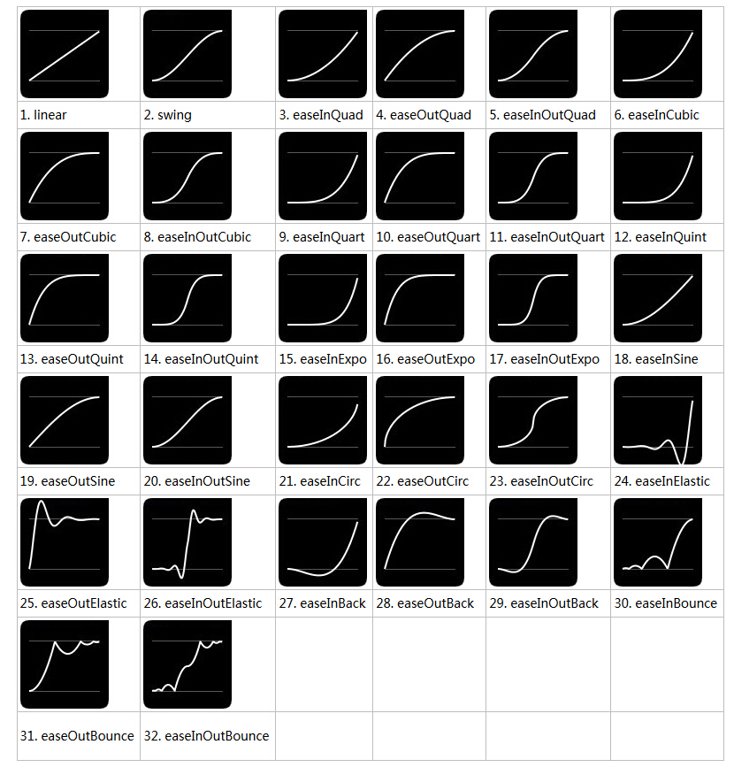
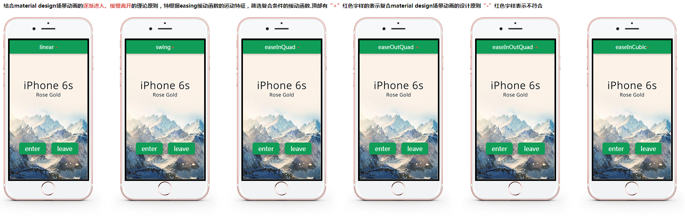
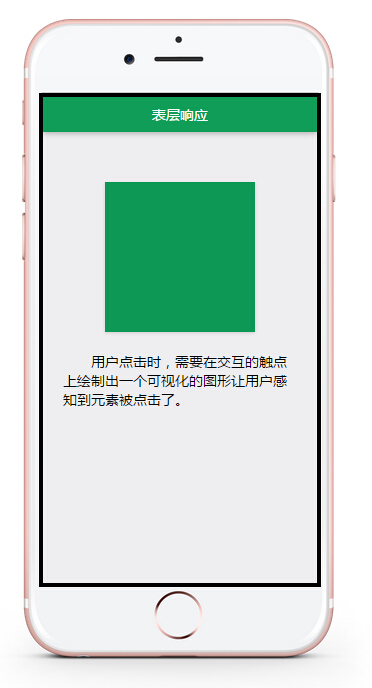
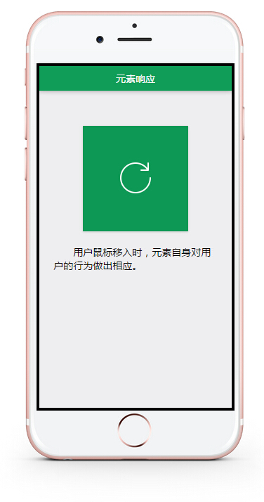
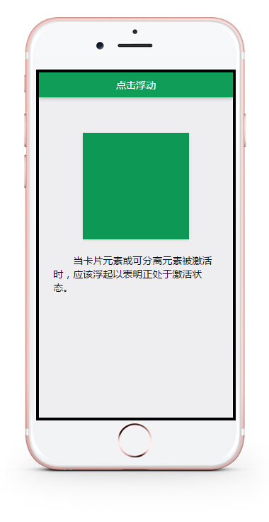
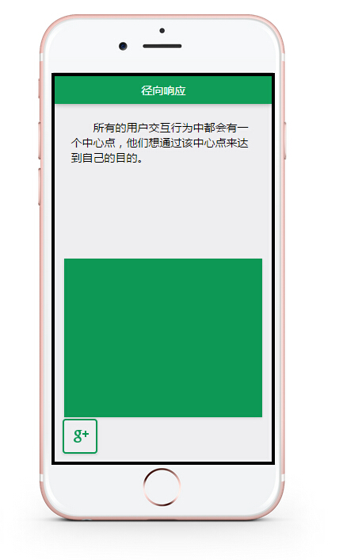

#lesson2.html

---

>`easing曲线在material design 动画中的使用`
>`标签：jQuery、jQuery.easing、js动画、用户体验`

---
##动画理论篇
###理论知识
       感知一个物体有形的部分可以帮助我们理解如何去控制它。观察一个物理的运动可以告诉我们它轻还是重，柔性还是刚性，小还是大。在 material design 设计规范中，动作不止是呈现着它美丽的一面，它还意味着在空间中的关系、功能以及在整个系统中的趋势。

       物理世界中物体拥有质量，所以只有当施加给它们力量的时候才会移动，因此物体没法在瞬间开始或者结束动作。动画突然开始或者停止，或者在运动时突兀的变化方向，都会使用户感到意外和不和谐的干扰。

       material design 规范中，一个重要方面在于如何在“动作”完整的展现物体的各个真实的特性，譬如优雅、简约、美观和神奇的无缝的用户体验，下面的动画将帮助大家理解这些理念。

---

###把握原则

**1、`迅速的加速`和`平滑的减速`会感到自然和愉快**
**2、线性动作会感到机械，在结束和开始的时候生硬的速度变化意味着物体突然开始运动或停止，这是不贴合现实的。**

---

###特殊情况：进入和推出的场景
       当一个物体进入这个场景时，请确保它在最高速度下移动，这个行为模拟了自然移动：一个人进入场景的时候，并不是从场景的边缘开始走入的，而是从更远的地方。当然，一个物体退出这个场景时，需要维持它的速度，缓慢的离开场景，逐渐的进入和缓慢的离开会把用户的注意力吸引到这个动作上，在大多数情况下，这是你希望的效果。

>`核心要点：逐渐的进入和缓慢的离开`

---

###最后总结
不是所有物体的移动方式是相同的，轻的/小的物体可能会更快的加速和减速，因为它们质量比较小，所以只需要施加给他们较少的力就可以。大的/重的物体可能花需要更多的时间来到达他的最高速度或者回到停止状态。仔细琢磨如何将他们的动作应用到你的应用的UI元素中。

---

##easing曲线篇
jquery.easing.js是jQuery的一个插件库，它描述了一个物体运动时的过渡表现方式，即官方说的缓动函数。在.animate()动画实践中，jquery默认自带了linear、swing两种过渡表现，更多表现方式就需要通过easing插件了。

[缓动函数速查表](http://easings.net/zh-cn#)

实际体验：[lesson2.html](lesson2.html)

##交互式响应动画

在 material design 中，应用是响应式的并且渴望用户操作的：

- `触摸，语音，键盘及鼠标作为首要考虑的输入方式。`
- `虽然 UI 元素是有形的，但是他们被限制在屏幕里面（电脑或者移动设备的屏幕），视觉元素和动效能减少这种割裂，让用户能够立即感知自己的操作。`

响应式交互把一个应用从简单展现用户所请求的信息，提升至能与用户产生更强烈、更具体化交互的工具。实际体验见[lesson2-1.html](lesson2-1.html)

###表层响应

>接收到输入事件，如点击屏幕，系统会立即在交互的触点上`绘制出一个可视化的图形让用户感知`到：如在点击屏幕时、使用麦克风时，或者键盘输入时，会出现类似于墨水扩散那样的视觉效果形状。这种效果被称为“触控涟漪”。

###元素响应
>和表层响应的触控涟漪一样，每个元素本身也能做出交互响应，物体可以在触控或点击的时候`浮`起来，以表示该元素正处于激活状态。用户可以通过点击、拖动来生成、改变元素或者直接对元素进行处理。需要把握的一个原则是：`元素从触控点展开时，通过视觉效果将元素与触控点联系起来`。

###点击浮动
>当卡片元素或可分离元素被`激活时，应该浮起`以表明正处于激活状态。

###径向响应
>所有的用户交互行为中都会有一个中心点，他们想通过该中心点来达到自己的目的。作为用户关注的中心点，应该绘制一个明显的视觉效果来让用户清晰地感知自己的输入（触摸屏幕、语音输入等）。在用户的操作中心点应该形成一个像涟漪一样逐渐发散开的径向动效响应。所有输入都有中心点，涟漪效果应从触控点、语音时屏幕上的语音图标、键盘输入时具体的按键点击位置上展开。这些输入动作产生时都应该在中心点形成一个视觉上的关联，从中心点展开一连串动作产生的涟漪效果。

